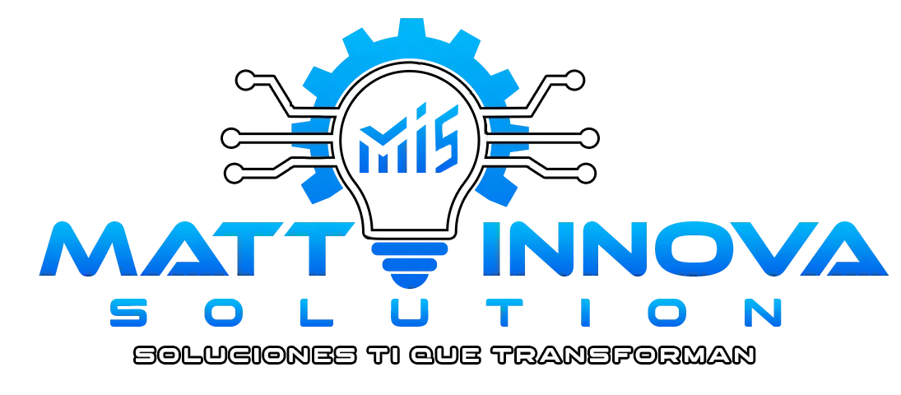

# MIS Library



[](https://deepwiki.com/MrAleexx/OpenLibrary)


OpenLibrary es un sistema moderno de gestión de bibliotecas construido con Laravel y Vue.js. Proporciona una plataforma robusta para administrar libros, usuarios, préstamos y más, aprovechando el poder de Inertia.js para una experiencia de aplicación de página única (SPA) fluida.

## 🚀 Tecnologías Utilizadas

Este proyecto utiliza un stack moderno para asegurar rendimiento, escalabilidad y una gran experiencia de desarrollo.

### Backend

- **[Laravel 12](https://laravel.com)**: El framework de PHP para artesanos web.
- **[Inertia.js](https://inertiajs.com)**: Construye SPAs sin construir una API.
- **[Laravel Fortify](https://laravel.com/docs/fortify)**: Implementación backend para autenticación.
- **[Spatie Laravel Permission](https://spatie.be/docs/laravel-permission)**: Gestión de roles y permisos.
- **[Maatwebsite Excel](https://docs.laravel-excel.com)**: Exportaciones e importaciones de Excel supercargadas.
- **[Pest](https://pestphp.com)**: Un framework de testing elegante para PHP.

### Frontend

- **[Vue 3](https://vuejs.org)**: El framework progresivo de JavaScript.
- **[TypeScript](https://www.typescriptlang.org)**: JavaScript con sintaxis para tipos.
- **[Vite](https://vitejs.dev)**: Herramientas de frontend de próxima generación.
- **[Tailwind CSS 4](https://tailwindcss.com)**: Un framework CSS de utilidad primero.
- **[Lucide Vue](https://lucide.dev)**: Iconos hermosos y consistentes.
- **[Date-fns](https://date-fns.org)**: Librería moderna de utilidad para fechas en JavaScript.

## 🏁 Comenzando

Sigue estos pasos para configurar el proyecto localmente en tu máquina.

### Requisitos Previos

Asegúrate de tener instalado lo siguiente:

- **PHP** >= 8.2
- **Composer**
- **Node.js** & **NPM**
- **MySQL**

### Instalación

1. **Clonar el repositorio**

    ```bash
    git clone https://github.com/MrAleexx/OpenLibrary.git
    cd OpenLibrary
    ```

2. **Instalar Dependencias**
   Puedes usar el script de configuración automatizado definido en `composer.json`:

    ```bash
    composer run setup
    ```

    O ejecutar los pasos manualmente:

    ```bash
    # Instalar Dependencias del Backend
    composer install

    # Configurar Entorno
    cp .env.example .env
    php artisan key:generate

    # Configurar Base de Datos
    # 1. Crea una base de datos vacía en tu servidor MySQL.
    # 2. Configura las credenciales de tu base de datos en el archivo .env (DB_DATABASE, DB_USERNAME, DB_PASSWORD).
    php artisan migrate

    # Instalar Dependencias del Frontend
    npm install
    npm run build
    ```

### Ejecutando la Aplicación

Para iniciar el servidor de desarrollo con recarga de módulos en caliente (HMR):

```bash
composer run dev
```

Este comando iniciará simultáneamente:

- El servidor de desarrollo de Laravel
- El servidor de desarrollo de Vite
- El worker de colas (Queue worker)

Accede a la aplicación en `http://localhost:8000`.

## 🧪 Ejecutando Tests

Para ejecutar la suite de pruebas usando Pest:

```bash
composer run test
```

## 📄 Licencia

Este proyecto ha sido desarrollado por **Matt Innova Solutions**.
