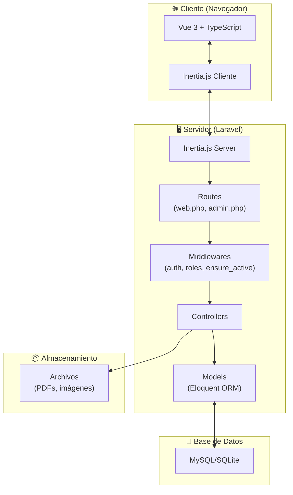
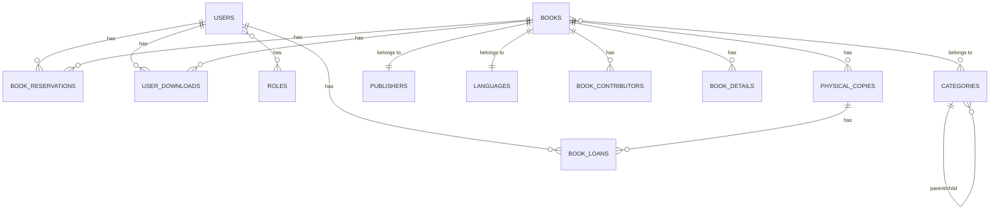
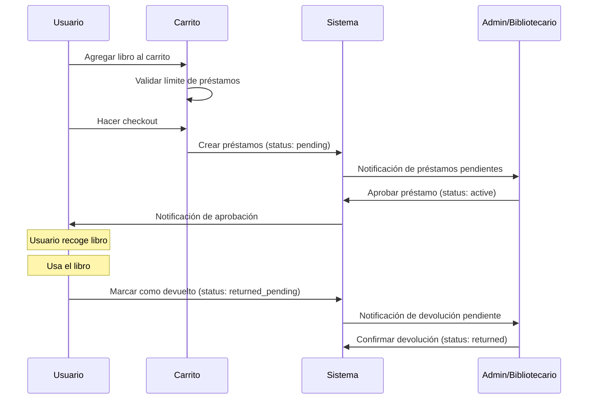
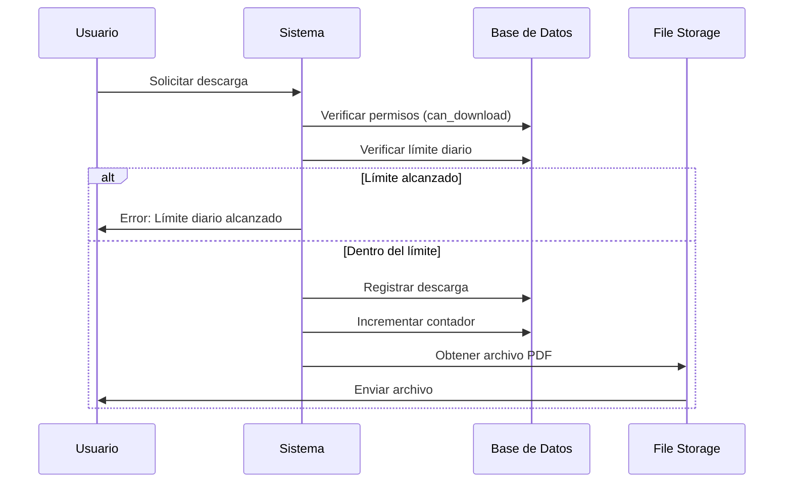
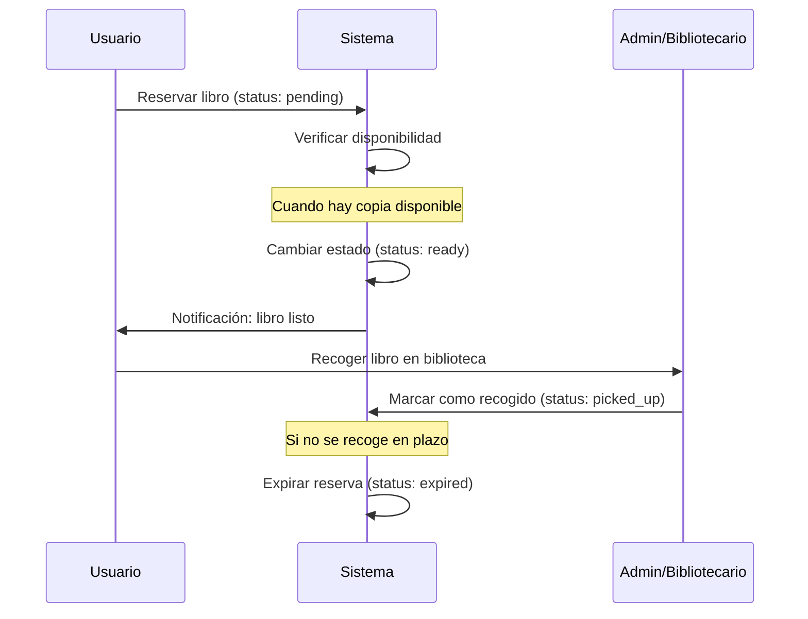
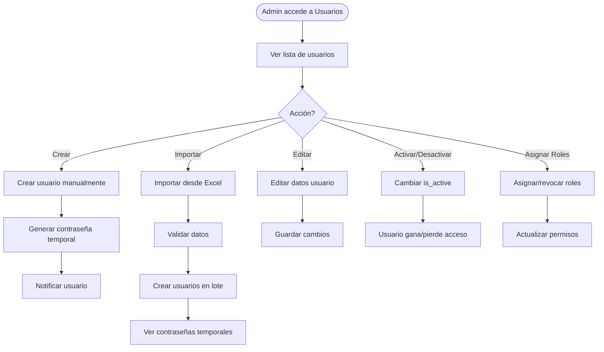

# Manual del Desarrollador - MIS Library

## 📋 Tabla de Contenidos

1. [Resumen del Proyecto](#-resumen-del-proyecto)
2. [Arquitectura General](#️-arquitectura-general)
3. [Stack Tecnológico](#-stack-tecnológico)
4. [Estructura del Proyecto](#-estructura-del-proyecto)
5. [Backend (Laravel)](#-backend-laravel)
6. [Frontend (Vue + TypeScript)](#-frontend-vue--typescript)
7. [Base de Datos](#-base-de-datos)
8. [Autenticación y Autorización](#-autenticación-y-autorización)
9. [Flujos de Trabajo Principales](#-flujos-de-trabajo-principales)
10. [Configuración y Despliegue](#️-configuración-y-despliegue)
11. [Convenciones de Código](#-convenciones-de-código)

---

## 📖 Resumen del Proyecto

   **MIS Library** es un sistema moderno de gestión de bibliotecas desarrollado con Laravel 12 y Vue 3. El sistema permite:

- ✅ Gestión de catálogo de libros (físicos y digitales)
- ✅ Sistema de préstamos y devoluciones
- ✅ Reservas de libros
- ✅ Descargas de PDFs (con límites diarios)
- ✅ Gestión de usuarios con roles y permisos
- ✅ Panel administrativo completo
- ✅ Sistema de reclamos y contacto
- ✅ Autenticación con verificación de email y 2FA
- ✅ Temas claro/oscuro
- ✅ Multilenguaje

---

## 🏗️ Arquitectura General



### Flujo de Solicitud

1. **Usuario** interactúa con la UI de Vue
2. **Inertia.js** intercepta navegación y envía peticiones AJAX
3. **Laravel** procesa la solicitud a través de rutas y middlewares
4. **Controladores** ejecutan lógica de negocio usando modelos
5. **Respuesta Inertia** devuelve datos JSON + nombre del componente Vue
6. **Vue** renderiza el componente con los datos recibidos

---

## 💻 Stack Tecnológico

### Backend

| Tecnología            | Versión | Propósito                     |
| --------------------- | ------- | ----------------------------- |
| **PHP**               | 8.2+    | Lenguaje de programación      |
| **Laravel**           | 12.x    | Framework web                 |
| **Inertia.js**        | 2.0+    | Adaptador SPA sin API         |
| **Laravel Fortify**   | 1.30+   | Autenticación backend         |
| **Spatie Permission** | 6.21+   | Roles y permisos              |
| **Maatwebsite Excel** | 3.1+    | Importación/exportación Excel |
| **Pest**              | 4.1+    | Testing framework             |

### Frontend

| Tecnología       | Versión | Propósito                     |
| ---------------- | ------- | ----------------------------- |
| **Vue.js**       | 3.5+    | Framework JavaScript reactivo |
| **TypeScript**   | 5.2+    | Tipado estático               |
| **Vite**         | 7.0+    | Build tool y dev server       |
| **Tailwind CSS** | 4.1+    | Framework CSS utility-first   |
| **Lucide Vue**   | 0.468+  | Librería de iconos            |
| **Reka UI**      | 2.6+    | Componentes UI accesibles     |
| **Date-fns**     | 4.1+    | Manipulación de fechas        |
| **VueUse**       | 12.8+   | Utilidades composables        |

### Base de Datos

- **SQLite** (desarrollo)
- **MySQL** (producción recomendada)

---

## 📂 Estructura del Proyecto

```
MIS Library/
├── app/
│   ├── Actions/              # Lógica de negocio reutilizable (ej. Fortify: CreateNewUser, ResetUserPassword)
│   ├── Console/              # Comandos personalizados de Artisan (ej. tareas programadas)
│   ├── Http/
│   │   ├── Controllers/      # Controladores que manejan las peticiones HTTP
│   │   │   ├── Admin/        # Controladores protegidos para gestión administrativa (Libros, Usuarios, Préstamos)
│   │   │   ├── Auth/         # Controladores de autenticación (Login, Registro, Verificación)
│   │   │   └── Settings/     # Controladores para configuración de perfil de usuario
│   │   └── Middleware/       # Filtros de peticiones HTTP (ej. HandleInertiaRequests, EnsureUserIsActive)
│   ├── Imports/              # Clases para importar datos desde Excel (usando Maatwebsite)
│   ├── Models/               # Modelos Eloquent que representan tablas de la BD (User, Book, Loan)
│   └── Providers/            # Service Providers para registrar servicios (AppServiceProvider, FortifyServiceProvider)
│
├── database/
│   ├── factories/            # Definiciones para generar datos de prueba (faker)
│   ├── migrations/           # Archivos de control de versiones de esquema de base de datos
│   └── seeders/              # Scripts para poblar la base de datos con datos iniciales
│
├── resources/
│   ├── js/
│   │   ├── actions/          # Funciones auxiliares o lógica de negocio frontend
│   │   ├── components/       # Componentes Vue reutilizables (Botones, Modales, Tarjetas)
│   │   ├── composables/      # Hooks personalizados de Vue (lógica de estado reutilizable)
│   │   ├── layouts/          # Plantillas de diseño (AppLayout, GuestLayout)
│   │   ├── pages/            # Vistas principales de Inertia (coinciden con las rutas)
│   │   │   ├── admin/        # Vistas del panel de administración
│   │   │   ├── auth/         # Vistas de login, registro, recuperación de contraseña
│   │   │   ├── Books/        # Vistas del catálogo público
│   │   │   ├── Cart/         # Vista del carrito de préstamos
│   │   │   ├── legal/        # Términos y condiciones, política de privacidad
│   │   │   ├── Loans/        # Vista de historial de préstamos del usuario
│   │   │   ├── Reservations/ # Vista de reservas del usuario
│   │   │   ├── settings/     # Vistas de configuración de cuenta
│   │   │   └── user/         # Dashboard principal del usuario
│   │   ├── types/            # Definiciones de tipos TypeScript para props y modelos
│   │   └── app.ts            # Punto de entrada de la aplicación Vue (configuración de Inertia)
│   └── css/
│       └── app.css           # Estilos globales y configuración de Tailwind CSS
│
├── routes/
│   ├── web.php              # Definición de rutas principales de la aplicación
│   ├── admin.php            # Rutas específicas del panel de administración
│   └── settings.php         # Rutas para la configuración de usuario
│
├── public/
│   ├── images/              # Assets estáticos públicos (logos, iconos)
│   └── storage/             # Enlace simbólico a storage/app/public para acceso web
│
├── storage/
│   └── app/
│       └── public/          # Almacenamiento de archivos subidos (portadas de libros, PDFs)
│
├── tests/                   # Pruebas automatizadas (Unitarias y de Características con Pest)
├── .env.example             # Plantilla de variables de entorno
├── composer.json            # Dependencias y scripts de PHP
├── package.json             # Dependencias y scripts de Node.js
└── vite.config.ts           # Configuración de compilación de assets con Vite
```

---

## 🔧 Backend (Laravel)

### Modelos Principales

#### 1. **User**

```php
// app/Models/User.php
```

**Campos principales:**

- `name`, `last_name`, `email`, `password`
- `user_type`: tipo de usuario (student, teacher, external, staff, admin)
- `institutional_id`, `institutional_email`, `microsoft_id`
- `is_active`: estado de aprobación del usuario
- `max_concurrent_loans`: límite de préstamos simultáneos
- `can_download`: permiso para descargar PDFs
- `downloads_today`, `last_download_reset`: control de límite de descargas

**Relaciones:**

- `loans()`: Préstamos del usuario
- `reservations()`: Reservas del usuario
- `downloads()`: Descargas realizadas
- `roles()`: Roles asignados (via Spatie)

**Métodos importantes:**

- `canBorrowMoreBooks()`: Verifica límite de préstamos
- `hasReachedDownloadLimit()`: Verifica límite de descargas diarias
- `hasMembershipExpired()`: Verifica vigencia de membresía

#### 2. **Book**

```php
// app/Models/Book.php
```

**Campos principales:**

- `title`, `isbn`, `publication_year`, `pages`
- `book_type`: tipo (physical, digital, both)
- `cover_image`, `pdf_file`: rutas de archivos
- `total_physical_copies`, `available_physical_copies`
- `downloadable`, `featured`, `is_active`
- `publisher_id`, `language_code`

**Relaciones:**

- `publisher()`: Editorial del libro
- `language()`: Idioma del libro
- `categories()`: Categorías (many-to-many)
- `contributors()`: Autores/editores
- `physicalCopies()`: Copias físicas
- `loans()`: Préstamos (through PhysicalCopy)
- `reservations()`: Reservas
- `downloads()`: Descargas

**Métodos importantes:**

- `isAvailableForLoan()`: Verifica disponibilidad
- `getAvailablePhysicalCopies()`: Cuenta copias disponibles
- `incrementViews()`, `incrementDownloads()`: Actualiza estadísticas

#### 3. **BookLoan**

**Estados posibles:**

- `pending`: Solicitud pendiente de aprobación
- `active`: Préstamo activo
- `returned_pending`: Devuelto, pendiente de confirmación
- `returned`: Devuelto confirmado
- `overdue`: Vencido
- `cancelled`: Cancelado

#### 4. **BookReservation**

**Estados posibles:**

- `pending`: Reserva pendiente
- `ready`: Libro listo para recoger
- `picked_up`: Libro recogido
- `cancelled`: Reserva cancelada
- `expired`: Reserva expirada

#### Otros Modelos

- **Category**: Categorías jerárquicas (con parent/children)
- **Publisher**: Editoriales
- **Language**: Idiomas
- **PhysicalCopy**: Copias físicas individuales
- **BookContributor**: Autores, editores, ilustradores
- **BookDetail**: Detalles adicionales del libro
- **UserDownload**: Registro de descargas
- **Claim**: Reclamos/contacto

### Controladores Principales

#### Públicos

- **`BookController`**: Gestiona la visualización del catálogo público.
    - `index()`: Lista libros con filtros (búsqueda, categoría) y paginación.
    - `show()`: Muestra detalles de un libro específico y sus copias disponibles.
- **`ClaimController`**: Maneja el formulario de contacto y reclamos.
    - `create()`: Muestra el formulario.
    - `store()`: Guarda el reclamo en la base de datos.

#### Autenticados (`auth` + `ensure_active`)

- **`DashboardController`**: Redirige al usuario a su dashboard correspondiente según su rol (Admin o Usuario).
- **`CartController`**: Gestiona el carrito de préstamos temporal.
    - `index()`: Muestra los libros en el carrito.
    - `store()`: Agrega un libro al carrito.
    - `destroy()`: Elimina un libro del carrito.
- **`LoanController`**: Permite al usuario ver su historial de préstamos.
    - `index()`: Lista préstamos activos e históricos del usuario autenticado.
- **`ReservationController`**: Maneja la creación de reservas para libros no disponibles.
    - `store()`: Crea una nueva reserva si el usuario cumple los requisitos.
- **`DownloadController`**: Gestiona la descarga segura de libros digitales.
    - `download()`: Verifica permisos y límites diarios antes de servir el archivo PDF.

#### Administrador (`auth` + `role:admin|librarian`)

- **`Admin\UserController`**: Gestión completa de usuarios.
    - `index()`: Lista usuarios con búsqueda y filtros.
    - `store()`: Crea un nuevo usuario manualmente.
    - `update()`: Edita información de usuario y roles.
    - `destroy()`: Desactiva o elimina un usuario.
- **`Admin\BookController`**: Gestión del inventario de libros.
    - `store()`: Crea un libro con subida de portada y PDF.
    - `update()`: Actualiza metadatos y archivos del libro.
- **`Admin\LoanController`**: Administración de préstamos.
    - `approve()`: Aprueba una solicitud de préstamo pendiente.
    - `return()`: Marca un préstamo como devuelto.
- **`Admin\UserImportController`**: Importación masiva.
    - `store()`: Procesa un archivo Excel para crear múltiples usuarios y generar contraseñas temporales.

### Middlewares Importantes

- **`auth`**: Usuario autenticado
- **`verified`**: Email verificado
- **`ensure_active`**: Usuario activo (aprobado por admin)
- **`role:admin`**: Solo administradores
- **`role:admin|librarian`**: Administradores o bibliotecarios

### Rutas

#### [web.php](routes/web.php)

- Rutas públicas (landing, términos, privacidad)
- Catálogo de libros público
- Carrito, préstamos, reservas (autenticados)
- Descargas (autenticados)

#### admin.php

- Todas las rutas administrativas con prefijo `/admin`

#### settings.php

- Configuración de perfil, contraseña, 2FA

---

## 🎨 Frontend (Vue + TypeScript)

### Estructura de Componentes

#### Layouts

- **`AppLayout.vue`**: Layout principal con sidebar y navegación
- **`GuestLayout.vue`**: Layout para usuarios no autenticados
- **`SettingsLayout.vue`**: Layout para páginas de configuración

#### Componentes Reutilizables

**UI Base** (en `components/ui/`):

- `Button`, `Input`, `Select`, `Textarea`
- `Card`, `Badge`, `Avatar`
- `Dialog`, `DropdownMenu`, `Tabs`
- `Table`, `Skeleton`, `Pagination`

**Componentes de Negocio**:

- **`AppSidebar.vue`**: Barra lateral de navegación responsiva. Contiene el menú principal y se adapta a móvil/escritorio.
- **`AppLogoPng.vue`**: Componente para mostrar el logo de la aplicación. Acepta props para ajustar tamaño y variante (claro/oscuro).
- **`BookCard.vue`**: Tarjeta de presentación de un libro. Muestra portada, título, autor, estado (disponible/agotado) y botón de acción (añadir al carrito/reservar).
- **`CategoryTree.vue`**: Componente recursivo para mostrar categorías y subcategorías en formato de árbol o lista anidada.
- **`LandingHeader.vue` / `LandingFooter.vue`**: Componentes de navegación y pie de página específicos para la página de bienvenida pública.

#### Páginas Principales

**Públicas**:

- `Welcome.vue`: Landing page
- `Books/Index.vue`: Catálogo de libros
- `Books/Show.vue`: Detalle de libro
- `legal/*`: Páginas legales

**Autenticadas**:

- `user/Dashboard.vue`: Dashboard del usuario
- `Cart/Index.vue`: Carrito de préstamos
- `Loans/Index.vue`: Mis préstamos
- `Reservations/Index.vue`: Mis reservas

**Administrador**:

- `admin/Dashboard.vue`: Dashboard administrativo
- `admin/users/Index.vue`: Gestión de usuarios
- `admin/books/Index.vue`: Gestión de libros
- `admin/categories/Index.vue`: Gestión de categorías
- `admin/loans/Index.vue`: Gestión de préstamos
- `admin/reservations/Index.vue`: Gestión de reservas

### Composables

#### [useCart.ts](resources/js/composables/useCart.ts)

Gestiona el carrito de préstamos con persistencia en `localStorage`.

**Funciones principales**:

- `addToCart(book)`: Agregar libro al carrito
- `removeFromCart(bookId)`: Remover libro
- `clearCart()`: Limpiar carrito
- `syncWithServer()`: Sincronizar con servidor
- `checkout()`: Procesar checkout

#### [useAppearance.ts](resources/js/composables/useAppearance.ts)

Gestiona temas (claro/oscuro) y preferencias de apariencia.

#### [useLoanPolling.ts](resources/js/composables/useLoanPolling.ts)

Polling para actualizar estado de préstamos en tiempo real.

#### [useTwoFactorAuth.ts](resources/js/composables/useTwoFactorAuth.ts)

Gestiona autenticación de dos factores (2FA).

### TypeScript Types

Definidos en `resources/js/types/`:

- **`index.d.ts`**: Types principales (User, Book, Loan, etc.)
- **`inertia.d.ts`**: Props compartidos de Inertia
- **Global types**: Extensiones de Window, etc.

---

## 💾 Base de Datos

### Diagrama ER Simplificado



### Tablas Principales

#### users

- **Campos clave**: name, email, user_type, is_active, max_concurrent_loans, can_download
- **Relaciones**: roles (many-to-many), loans, reservations, downloads

#### books

- **Campos clave**: title, isbn, book_type, downloadable, featured
- **Relaciones**: publisher, language, categories, contributors, physical_copies

#### physical_copies

- **Campos**: book_id, barcode, status (available, on_loan, reserved, maintenance, lost)
- **Relaciones**: book, loans

#### book_loans

- **Campos**: user_id, physical_copy_id, status, borrowed_at, due_date, returned_at
- **Estados**: pending, active, returned_pending, returned, overdue, cancelled

#### book_reservations

- **Campos**: user_id, book_id, status, reserved_at, expires_at
- **Estados**: pending, ready, picked_up, cancelled, expired

#### categories

- **Campos**: name, slug, parent_id, description, icon
- **Relaciones**: parent, children (self-referencing)

### Migraciones Importantes

1. `create_permission_tables.php`: Tablas de Spatie (roles, permissions)
2. `create_users_table.php`: Tabla de usuarios
3. `create_books_table.php`: Tabla de libros
4. `create_physical_copies_table.php`: Copias físicas
5. `create_book_loans_table.php`: Préstamos
6. `create_book_reservations_table.php`: Reservas

---

## 🔐 Autenticación y Autorización

### Sistema de Autenticación

**Laravel Fortify** proporciona:

- Login/Register
- Email verification
- Password reset
- Two-factor authentication (2FA)
- Password confirmation

### Roles y Permisos (Spatie)

#### Roles Principales

| Rol           | Descripción    | Permisos                                      |
| ------------- | -------------- | --------------------------------------------- |
| **admin**     | Administrador  | Acceso total al sistema                       |
| **librarian** | Bibliotecario  | Gestión de libros, préstamos, usuarios        |
| **user**      | Usuario normal | Préstamos, reservas, descargas (según config) |

#### Permisos Granulares

**Usuarios**:

- `view users`, `create users`, `edit users`, `delete users`
- `import users`, `export users`

**Libros**:

- `view books`, `create books`, `edit books`, `delete books`
- `manage categories`, `manage publishers`

**Préstamos**:

- `view loans`, `approve loans`, `manage loans`
- `view reservations`, `manage reservations`

**Sistema**:

- `manage settings`, `view reports`

### Middleware de Autorización

```php
// Solo administradores
Route::middleware(['auth', 'role:admin'])->group(function () {
    // ...
});

// Admin o bibliotecario
Route::middleware(['auth', 'role:admin|librarian'])->group(function () {
    // ...
});

// Usuario activo (aprobado)
Route::middleware(['auth', 'ensure_active'])->group(function () {
    // ...
});
```

### Flujo de Aprobación de Usuarios

1. Usuario se registra
2. Usuario verifica email
3. **Usuario queda inactivo** (`is_active = false`)
4. Usuario puede:
    - Acceder a `/approval-pending`
    - Editar su perfil
    - **NO puede** acceder a otras páginas protegidas
5. Admin/Bibliotecario **aprueba** al usuario
6. Usuario puede acceder a todas las funcionalidades

---

## 🔄 Flujos de Trabajo Principales

### 1. Flujo de Préstamo de Libro Físico



### 2. Flujo de Descarga de PDF



### 3. Flujo de Reserva



### 4. Flujo de Gestión de Usuarios (Admin)



---

## ⚙️ Configuración y Despliegue

### Configuración Inicial

1. **Clonar repositorio**:

    ```bash
    git clone https://github.com/MrAleexx/OpenLibrary.git
    cd OpenLibrary
    ```

2. **Instalar dependencias**:

    ```bash
    # Automático
    composer run setup

    # Manual
    composer install
    cp .env.example .env
    php artisan key:generate
    npm install
    npm run build
    ```

3. **Configurar base de datos** (`.env`):

    ```env
    DB_CONNECTION=mysql
    DB_HOST=127.0.0.1
    DB_PORT=3306
    DB_DATABASE=mislibrary
    DB_USERNAME=root
    DB_PASSWORD=
    ```

4. **Ejecutar migraciones**:

    ```bash
    php artisan migrate
    ```

5. **Crear usuario administrador** (opcional):

    ```bash
    php artisan tinker

    $user = User::create([
        'name' => 'Admin',
        'last_name' => 'System',
        'email' => 'admin@example.com',
        'password' => bcrypt('password'),
        'user_type' => 'admin',
        'is_active' => true,
        'email_verified_at' => now(),
    ]);

    $user->assignRole('admin');
    ```

6. **Crear symlink de storage**:
    ```bash
    php artisan storage:link
    ```

### Desarrollo Local

```bash
# Iniciar servidor de desarrollo (Laravel + Vite + Queue)
composer run dev

# O manualmente
php artisan serve          # Puerto 8000
npm run dev                # Puerto 5173 (proxy)
php artisan queue:listen   # Worker de colas
```

Acceder en: `http://localhost:8000`

### Despliegue en Producción

#### Requisitos del Servidor

- PHP 8.2+
- MySQL 8.0+
- Composer
- Node.js & NPM
- Configuración de servidor web (Apache/Nginx)

#### Pasos de Despliegue

1. **Configurar `.env` de producción**:

    ```env
    APP_ENV=production
    APP_DEBUG=false
    APP_URL=https://tu-dominio.com

    DB_CONNECTION=mysql
    DB_HOST=localhost
    DB_DATABASE=mislibrary_prod
    DB_USERNAME=db_user
    DB_PASSWORD=db_password_segura

    MAIL_MAILER=smtp
    # ... configurar mail
    ```

2. **Compilar assets**:

    ```bash
    npm run build
    ```

3. **Optimizaciones**:

    ```bash
    composer install --optimize-autoloader --no-dev
    php artisan config:cache
    php artisan route:cache
    php artisan view:cache
    ```

4. **Permisos**:
    ```bash
    chmod -R 775 storage bootstrap/cache
        - export DEPLOYPATH=/home/user/public_html/
        - /bin/cp -R * $DEPLOYPATH
        - cd $DEPLOYPATH
        - php artisan migrate --force
        - php artisan config:cache
        - php artisan route:cache
        - php artisan view:cache
    ```

````

---

## 📝 Convenciones de Código

### Backend (PHP/Laravel)

#### Nombres de Archivos y Clases

- **Modelos**: PascalCase singular (`User`, `Book`, `BookLoan`)
- **Controladores**: PascalCase con sufijo Controller (`BookController`, `UserController`)
- **Migraciones**: snake_case con fecha (`2025_10_24_create_books_table.php`)

#### Métodos y Variables

- **Métodos**: camelCase (`getActiveLoans()`, `canBorrowBook()`)
- **Variables**: camelCase (`$activeLoans`, `$userName`)
- **Constantes**: UPPER_SNAKE_CASE (`MAX_LOANS`, `DEFAULT_ROLE`)

#### Rutas

- **URLs**: kebab-case (`/admin/book-loans`, `/user/my-reservations`)
- **Nombres de rutas**: dot notation (`books.index`, `admin.users.create`)

#### Ejemplo de Controlador

```php
<?php

namespace App\Http\Controllers\Admin;

use App\Http\Controllers\Controller;
use App\Models\Book;
use Illuminate\Http\Request;
use Inertia\Inertia;

class BookController extends Controller
{
    public function index(Request $request)
    {
        $books = Book::with(['publisher', 'language', 'categories'])
            ->when($request->search, fn($query, $search) =>
                $query->search($search)
            )
            ->paginate(20);

        return Inertia::render('admin/books/Index', [
            'books' => $books,
        ]);
    }
}
````

### Frontend (Vue/TypeScript)

#### Nombres de Archivos y Componentes

- **Componentes**: PascalCase (`BookCard.vue`, `UserAvatar.vue`)
- **Páginas**: PascalCase (`Index.vue`, `Show.vue`, `Dashboard.vue`)
- **Composables**: camelCase con prefijo `use` (`useCart.ts`, `useAuth.ts`)
- **Types**: PascalCase (`User`, `Book`, `BookLoan`)

#### Variables y Funciones

- **Variables**: camelCase (`const userName`, `let bookCount`)
- **Funciones**: camelCase (`fetchBooks()`, `handleSubmit()`)
- **Constantes**: UPPER_SNAKE_CASE (`const MAX_ITEMS = 10`)

#### Props y Emits

```typescript
// Props tipadas
interface Props {
    book: Book;
    isActive?: boolean;
}

const props = defineProps<Props>();

// Emits tipados
interface Emits {
    (e: 'update', value: Book): void;
    (e: 'delete', id: number): void;
}

const emit = defineEmits<Emits>();
```

#### Composables Pattern

```typescript
// useCart.ts
export function useCart() {
    const cart = ref<CartItem[]>([]);

    const addToCart = (book: Book) => {
        // ...
    };

    const removeFromCart = (bookId: number) => {
        // ...
    };

    return {
        cart: computed(() => cart.value),
        addToCart,
        removeFromCart,
    };
}
```

### Estilos CSS (Tailwind)

#### Clases de Utilidad

- **Preferir** clases de Tailwind sobre CSS personalizado
- **Agrupar** clases por categoría (layout, spacing, colors, typography)

```vue
<div
    class="flex items-center justify-between rounded-lg border border-gray-200 bg-white px-4 py-3 text-sm font-medium shadow-sm dark:border-gray-700 dark:bg-gray-800"
></div>
```

#### Variables CSS Personalizadas

Definidas en `resources/css/app.css`:

```css
@layer base {
    :root {
        --color-primary: 99 102 241;
        --color-secondary: 139 92 246;
        --radius: 0.5rem;
    }
}
```

### Git Workflow

#### Commits

Formato: `tipo(scope): descripción`

**Tipos**:

- `feat`: Nueva funcionalidad
- `fix`: Corrección de bug
- `refactor`: Refactorización
- `style`: Cambios de estilo/formato
- `docs`: Documentación
- `test`: Tests
- `chore`: Tareas de mantenimiento

**Ejemplos**:

```
feat(books): add downloadable filter to catalog
fix(cart): sync cart items on page load
refactor(loans): extract loan validation to service
docs(readme): update installation instructions
```

#### Branches

- `main`: Producción
- `develop`: Desarrollo
- `feature/*`: Nuevas funcionalidades
- `fix/*`: Correcciones
- `hotfix/*`: Correcciones urgentes de producción

---

## 🎯 Módulos Funcionales

### Gestión de Libros

**Modelos involucrados**: `Book`, `BookDetail`, `BookContributor`, `Category`, `Publisher`, `Language`

**Funcionalidades**:

- ✅ CRUD completo de libros
- ✅ Categorización jerárquica
- ✅ Autores y contribuyentes múltiples
- ✅ Gestión de copias físicas
- ✅ Carga de imágenes de portada
- ✅ Carga de archivos PDF
- ✅ Marcado como destacado
- ✅ Activación/desactivación

### Gestión de Préstamos

**Modelos involucrados**: `BookLoan`, `PhysicalCopy`, `Book`, `User`

**Flujo**:

1. Usuario agrega libros al carrito
2. Usuario hace checkout → préstamos en estado `pending`
3. Admin/bibliotecario aprueba → estado `active`
4. Usuario marca como devuelto → estado `returned_pending`
5. Admin confirma devolución → estado `returned`

**Control**:

- Límite de préstamos simultáneos por usuario
- Fechas de vencimiento automáticas
- Detección de préstamos vencidos
- Historial completo de préstamos

### Gestión de Reservas

**Modelos involucrados**: `BookReservation`, `Book`, `User`

**Casos de uso**:

- Reservar libro agotado
- Notificación cuando esté disponible
- Tiempo límite para recoger
- Expiración automática

### Sistema de Descargas

**Modelos involucrados**: `UserDownload`, `Book`, `User`

**Características**:

- Límite de 5 descargas diarias por usuario
- Reset automático diario
- Registro de todas las descargas
- Estadísticas por libro

### Gestión de Usuarios

**Modelos involucrados**: `User`, `Role`, `Permission`

**Funcionalidades**:

- CRUD de usuarios
- Importación masiva desde Excel
- Generación de contraseñas temporales
- Gestión de roles y permisos
- Activación/desactivación
- Control de membresías

---

## 📊 Reportes y Estadísticas

### Dashboard Administrativo

**KPIs mostrados**:

- Total de libros activos
- Préstamos activos / vencidos
- Reservas pendientes
- Usuarios activos / inactivos
- Descargas del mes
- Top libros más prestados

### Dashboard de Usuario

**Información mostrada**:

- Préstamos activos (con fechas de vencimiento)
- Reservas pendientes
- Descargas recientes
- Límite de descargas diarias
- Acciones rápidas

---

## 🔍 Testing

### Pest (Backend)

```bash
# Ejecutar todos los tests
composer run test

# Ejecutar tests específicos
php artisan test --filter BookTest

# Con cobertura
php artisan test --coverage
```

---

## 🛠️ Comandos Útiles

### Artisan

```bash
# Limpiar caché
php artisan cache:clear
php artisan config:clear
php artisan view:clear
php artisan route:clear

# Optimizaciones
php artisan optimize
php artisan config:cache
php artisan route:cache
php artisan view:cache

# Migraciones
php artisan migrate
php artisan migrate:fresh --seed
php artisan migrate:rollback

# Tinker (REPL)
php artisan tinker
```

### Composer Scripts

```bash
composer run setup    # Setup inicial completo
composer run dev      # Desarrollo (Laravel + Vite + Queue)
composer run test     # Ejecutar tests
```

### NPM Scripts

```bash
npm run dev           # Desarrollo (Vite)
npm run build         # Build producción
npm run format        # Formatear código (Prettier)
npm run lint          # Linting (ESLint)
```

---

## 🐛 Debugging

### Laravel Telescope (opcional)

Para debugging más avanzado, puedes instalar Telescope:

```bash
composer require laravel/telescope --dev
php artisan telescope:install
php artisan migrate
```

Acceder en: `http://localhost:8000/telescope`

### Vue DevTools

Instalar extensión del navegador: [Vue DevTools](https://devtools.vuejs.org/)

---

## 📚 Recursos Adicionales

### Documentación Oficial

- [Laravel Documentation](https://laravel.com/docs)
- [Vue.js Documentation](https://vuejs.org/guide)
- [Inertia.js Documentation](https://inertiajs.com/)
- [Tailwind CSS Documentation](https://tailwindcss.com/docs)
- [Spatie Permission](https://spatie.be/docs/laravel-permission)

### Comunidad

- **DeepWiki**: [](https://deepwiki.com/MrAleexx/OpenLibrary)
- **GitHub**: [MrAleexx/OpenLibrary](https://github.com/MrAleexx/OpenLibrary)

---

## 📧 Contacto

**Desarrollado por**: [Matt Innova Solutions](https://www.mattinnovasolution.com/)

Para consultas o soporte, utiliza el sistema de reclamos integrado en la aplicación.
